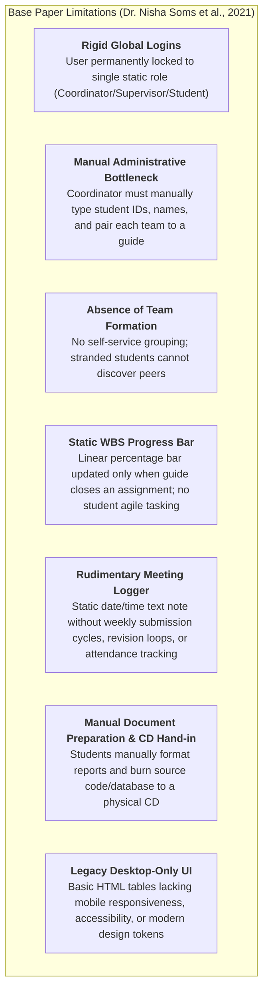
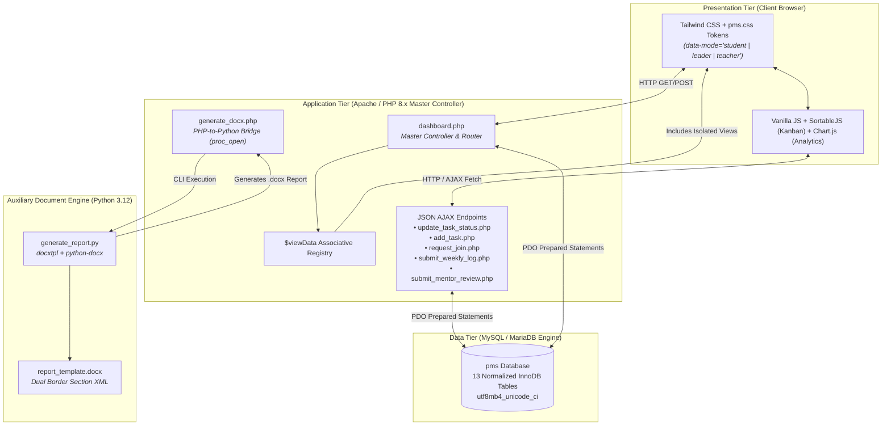
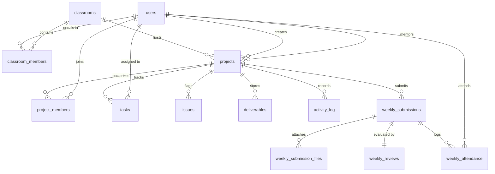
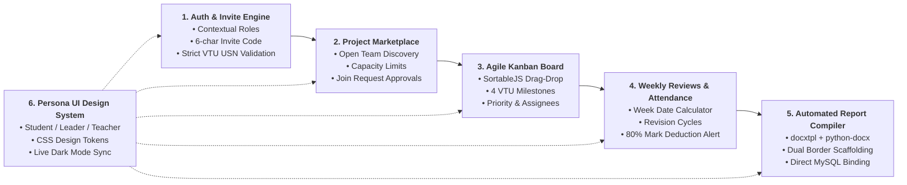
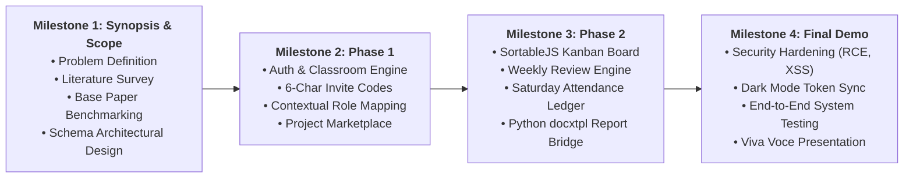

# PROJECT SYNOPSIS REPORT

## PMS: An Agile Multi-Tenant Academic Project Management and Automated Evaluation Platform

---

### Academic Information

* **Degree / Program**: Bachelor of Engineering (B.E.) in Computer Science & Engineering
* **Course Title**: Mini-Project with Seminar
* **Course Code**: 21CSMP58
* **Semester**: 5th Semester
* **Affiliating University**: Visvesvaraya Technological University (VTU), Belagavi, Karnataka
* **Academic Year**: 2025–2026 / 2026–2027

---

### Candidate & Guide Details

| Role | Name | USN / Faculty ID | Department |
| :--- | :--- | :--- | :--- |
| **Project Leader / Student 1** | [Student Name 1] | [1RG24CS001] | Computer Science & Engineering |
| **Team Member / Student 2** | [Student Name 2] | [1RG24CS002] | Computer Science & Engineering |
| **Team Member / Student 3** | [Student Name 3] | [1RG24CS003] | Computer Science & Engineering |
| **Team Member / Student 4** | [Student Name 4] | [1RG24CS004] | Computer Science & Engineering |
| **Faculty Guide / Mentor** | [Guide Name] | [Faculty ID / Designation] | Computer Science & Engineering |
| **Project Coordinator** | [Coordinator Name] | [Faculty ID / Designation] | Computer Science & Engineering |
| **Head of Department (HOD)** | [HOD Name] | [Faculty ID / Professor & Head] | Computer Science & Engineering |

---

## 1. Abstract

Undergraduate engineering curricula, notably under Visvesvaraya Technological University (VTU) guidelines, mandate multi-month team-based capstone and mini-projects to cultivate engineering design and problem-solving skills. However, managing dozens of project batches across multiple sections using traditional, ad-hoc methods—such as WhatsApp groups, disjointed email chains, shared spreadsheets, and manual paper logbooks—leads to critical operational bottlenecks: lost project artifacts, non-transparent team contributions, unrecorded weekly attendance, and last-minute formatting chaos during report submission.

This project presents **PMS**, a modern, web-based, multi-tenant academic project management and automated evaluation system designed specifically for engineering institutions. Built on a robust **PHP 8.x and MySQL (InnoDB)** architecture running on Apache/XAMPP, with auxiliary **Python 3.12 (`docxtpl`)** micro-services, PMS transitions academic project governance from static administrative monitoring into an agile, student-empowering environment. 

PMS introduces four foundational innovations:
1. **Contextual Role Multi-Tenancy**: Decouples roles from user identities, allowing a faculty member to serve as a high-level Department Coordinator in one classroom while acting as an assigned Faculty Guide in another.
2. **Autonomous Project Marketplace**: Empowers unassigned students to self-assemble teams and submit join requests against defined capacity boundaries (`min_team_size` and `max_team_size`), eliminating administrative matchmaking bottlenecks.
3. **Interactive Drag-and-Drop Kanban Engine**: Replaces static assignment sheets with an agile task workflow (Todo, In Progress, Done) powered by SortableJS, tracked across four standardized VTU milestones (`Synopsis`, `Phase 1`, `Phase 2`, `Final Demo`).
4. **Automated Weekly Review & Attendance Engine with Report Compiler**: Integrates a Saturday guide meeting attendance ledger that enforces the VTU 80% attendance rule with automated mark-deduction alerts, and a headless Python compiler that binds live database metadata directly into an official VTU-formatted `.docx` report with dual-border section geometry and academic scaffolding.

PMS provides a cohesive digital ecosystem that enhances student accountability, simplifies faculty evaluation, and guarantees compliance with institutional academic standards.

---

## 2. Introduction & Background

Engineering education places paramount emphasis on Project-Based Learning (PBL). Under the VTU B.E. Computer Science curriculum, courses such as the 5th Semester Mini-Project (Course Code: `21CSMP58`) require undergraduate students to synthesize theoretical concepts into practical software solutions. In a typical academic department with 120–180 students per batch, 30 to 45 distinct project teams operate concurrently under 10 to 15 faculty guides, overseen by a single project coordinator.

In conventional setups, the coordination of these projects is plagued by high friction:
* **Coordination Overhead**: Project coordinators manually collect project proposals, verify team sizes, record University Seat Numbers (USNs), and assign guides via manual spreadsheets.
* **Lack of Visibility**: Guides lack real-time visibility into day-to-day task progression, individual student contributions, and blocker issues.
* **Attendance Inaccuracies**: University regulations dictate that weekly progress meetings (conventionally conducted on Saturdays) require 80% attendance to avoid grade penalties. Manual paper registers often result in disputed records and lack auditable compliance.
* **Documentation Standardization Deficit**: Students frequently spend weeks formatting preliminary report pages (certificates, declarations, acknowledgments, tables of contents) according to university style manuals, detracting time from core software engineering efforts.

To bridge these operational gaps, **PMS** was conceived as a domain-tailored, multi-tier web application that unifies student collaboration, faculty supervision, attendance enforcement, and automated document compilation into a streamlined digital workflow.

---

## 3. Literature Survey & Base Paper Reference

### 3.1. Primary Base Paper
* **Paper Title**: *Student Project Management System*
* **Authors**: Dr. Nisha Soms, S Prashanth, P Preethika, D Deepak Kumar
* **Publication**: *International Journal of All Research Education and Scientific Methods (IJARESM)*, Volume 9, Issue 3, March 2021, ISSN: 2455-6211.
* **Key Contribution**: Proposed a web-based portal using PHP and MySQL to replace classical manual processes in Indian CSE final-year projects. The system introduced centralized logins for Coordinators, Supervisors, and Students; manual supervisor allocation; document upload facilities (abstracts, proposals, code, and reports); meeting scheduling; an internal mail module; and a Work Breakdown Structure (WBS) progress bar.

### 3.2. Supporting Academic Literature
1. **Mamoun Awad (2017)** — *"GPMS: An educational supportive graduation project management system,"* *Computer Applications in Engineering Education (Wiley)*, Vol. 25, No. 6:
   * Formalized multi-role academic workflows, call-for-proposals, deliverable repositories, exam conflict resolution, and data analytics (WEKA Decision Trees and Association Rule Mining) to detect student performance anomalies.
2. **Patrick Letouze, Robson A. Ronzani, Ary H. M. Oliveira (2011)** — *"An Academic Project Management Web System Developed through a Software House Simulation in a Classroom,"* *IPEDR*, Vol. 10:
   * Established the paradigm of aligning software development phases with a structured **6-chapter monograph textual structure** (Introduction, Theoretical Foundation, Related Work, Development, Results, Conclusion), proving that academic milestones must anchor project management tools.

---

## 4. Limitations of the Existing System (Base Paper)

While the base paper by **Dr. Nisha Soms et al. (2021)** demonstrated the validity of utilizing a PHP/MySQL architecture for student project management, comprehensive analysis reveals key limitations that restrict its scalability and effectiveness in modern engineering environments:

1. **Rigid Global Role Architecture**: Users choose a role at login. A faculty member cannot simultaneously coordinate one subject and serve as an advisor in another; roles are not contextual to academic classrooms.
2. **Administrative Bottleneck**: The coordinator must manually input every student account, faculty account, and team-to-supervisor pairing, creating substantial administrative overhead at the beginning of each semester.
3. **No Self-Service Team Formation**: The system provides no marketplace for unassigned students to discover projects, propose novel ideas, or request membership in open teams.
4. **Static, Non-Agile Task Tracking**: Progress is tracked via a monolithic progress bar incremented only when faculty concludes an assignment. Students have no interactive Kanban board to distribute tasks, set priorities, or flag blockers.
5. **Lack of Attendance Compliance & Revision Workflows**: The meeting module simply records meeting notices. It does not calculate academic weeks, enforce weekly submission deadlines, support iterative revision states (`approved` vs. `revision_needed`), or track Saturday meeting attendance against university regulatory thresholds (e.g., VTU 80% rule).
6. **Manual Report Formatting & Physical Submissions**: Students must manually handle document styling and burn files to physical CDs. There is no automated bridge between database records and official university-compliant documentation.

---

## 5. Objectives of the Proposed System

The primary objective of **PMS** is to build a complete, resilient, and agile academic project management web platform that overcomes the limitations of prior research.

Specific objectives include:
1. **Contextual Role Multi-Tenancy**: Design and implement a classroom-scoped access control model where user permissions (`Admin` / `Team Member`) are determined dynamically per classroom workspace rather than globally.
2. **Self-Service Onboarding & Project Marketplace**: Provide 6-character cryptographic invite codes for instant enrollment with strict VTU USN regex validation (`1RG24CS015`), coupled with a dynamic Project Marketplace where unassigned students can browse open teams or launch new projects within configurable team-size limits.
3. **Interactive Drag-and-Drop Kanban Task Engine**: Build an interactive client-side Kanban board (SortableJS) integrated with asynchronous JSON endpoints (`update_task_status.php`) to manage task states (`todo`, `inprogress`, `done`), priority levels, assignee tagging, and milestone categorizations (`Synopsis`, `Phase 1`, `Phase 2`, `Final Demo`).
4. **Structured Weekly Review & Saturday Attendance Engine**: Develop an automated review pipeline that calculates academic weeks from semester start and end dates, supports Project Leader weekly progress logs with file uploads, allows faculty mentors to evaluate submissions with remarks (`approved` / `revision_needed`), and enforces Saturday meeting attendance with automated warnings for attendance below 80%.
5. **Automated Headless VTU Report Compiler**: Engineer a server-side bridge combining PHP (`proc_open`) and Python (`docxtpl`, `python-docx`) that automatically binds live project metadata, student USNs, and institutional signatures into an official VTU-compliant Word template with dual section borders and structured academic scaffolding (Chapters 1–6).
6. **Persona-Tailored UI & Dynamic Theme Tokens**: Implement a responsive design system utilizing Tailwind CSS and CSS custom properties (`pms.css`) that adapts layouts, typography, and color tokens across three distinct personas (`Student Workbench`, `Leader Control Room`, `Teacher Marking Desk`), featuring live dark-mode Chart.js canvas re-rendering.
7. **Security & Data Hardening**: Secure all database interactions using PDO prepared statements, prevent Remote Code Execution (RCE) via file extension whitelists and `.htaccess` execution blocks, and eliminate DOM-XSS through client-side HTML entity escaping.

---

## 6. System Architecture & Methodology

PMS employs a decoupled **3-Tier Web Architecture** paired with the **Master Controller Pattern** in PHP 8.x:

### 6.1. The Master Controller & `$viewData` Pattern
To maintain strict separation of concerns, view templates inside `views/*.php` are purely presentational and **never perform direct SQL queries**. All database retrieval, role evaluation, session validation, and data formatting are handled exclusively by `dashboard.php`, which aggregates state into a structured `$viewData` array before delegating to the appropriate persona view:
* `views/student.php`: Personal workbench, assigned tasks, deliverable uploads.
* `views/leader.php`: Team control room, Kanban management, member approvals, weekly log uploads.
* `views/teacher.php`: Marking desk, classroom group ledger, faculty roster, mentor review modals.
* `views/marketplace.php`: Team discovery portal for unassigned students.

### 6.2. Contextual Role & Database Architecture
The database `pms` consists of **13 normalized tables** defined in [`schema.sql`](file:///D:/1University/5thsem/3_Personal/pjtmgmt/schema.sql):

1. **`users`**: Global authentication credentials (salted bcrypt hash), timestamp.
2. **`classrooms`**: Isolated course workspace with `invite_code`, `requires_usn`, `min_team_size`, `max_team_size`, `start_date`, and `end_date`.
3. **`classroom_members`**: Contextual role (`Admin` or `Team Member`), student `usn`, scoped uniquely to `classroom_id`.
4. **`projects`**: Subproject team within a classroom, linked to `created_by` (Leader) and `mentor_id` (Faculty Guide).
5. **`project_members`**: Student membership status (`Pending`, `Active`) and `is_leader` flag.
6. **`tasks`**: Kanban items with `status` (`todo`, `inprogress`, `done`), `milestone`, `priority`, `due_date`, and `assigned_to`.
7. **`issues`**: Blocker tracker with `severity` (`amber`, `red`) and `status` (`open`, `resolved`).
8. **`deliverables`**: Project document attachments with file paths and metadata.
9. **`activity_log`**: Tamper-evident audit trail capturing user actions and transitions.
10. **`weekly_submissions`**: Weekly milestone progress log submitted by Project Leader (`work_summary`, `next_steps`).
11. **`weekly_submission_files`**: Documents and code archives attached to weekly logs.
12. **`weekly_reviews`**: Mentor evaluation record (`status`: `pending`, `approved`, `revision_needed`) and feedback remarks.
13. **`weekly_attendance`**: Matrix of student attendance (`present`: 0 or 1) per weekly meeting.

---

## 7. Key Functional Modules

### Module 1: Authentication, Classroom Isolation & USN Validation
* Secure user registration and login using PHP `password_hash()` (bcrypt) and `password_verify()`.
* Classroom creation generates a unique 6-character case-sensitive alphanumeric invite code (`utf8mb4_bin`).
* Joining requires students to submit an official VTU USN (validated via strict regular expression matching university syntax `^[0-9][A-Z]{2}[0-9]{2}[A-Z]{2}[0-9]{3}$`), preventing invalid entries.

### Module 2: Project Marketplace & Autonomous Team Formation
* Solves the problem of unassigned or isolated students.
* Unassigned students enter the Marketplace view (`views/marketplace.php`), displaying all classroom projects that have not yet reached `max_team_size`.
* Students can click "Request to Join" (creating a `Pending` record in `project_members`) or launch their own project and automatically become the Project Leader.
* The Project Leader manages applications from their Control Room with single-click Accept actions.

### Module 3: Interactive Kanban & Milestone Tracking Engine
* Full-fledged agile workflow replacing static assignments.
* Drag-and-drop state transitions (`todo` ⇄ `inprogress` ⇄ `done`) powered by SortableJS, transmitting instantaneous updates to `update_task_status.php` via JSON `fetch` requests.
* Tasks are categorized into four VTU academic milestones: **Synopsis**, **Phase 1**, **Phase 2**, and **Final Demo**.
* Tasks support priority flags (`normal`, `high`), due dates, and individual member assignments.
* Integrated issue tracker enables students to raise `amber` and `red` blockers for faculty review.

### Module 4: Weekly Review & Saturday Meeting Attendance Engine
* Automates weekly continuous internal evaluation (CIE).
* The coordinator defines classroom `start_date` and `end_date`, from which the system calculates discrete 7-day academic cycles.
* **Student Leader Submission**: Project Leaders upload weekly logs summarizing progress and planned next steps alongside technical attachments.
* **Faculty Review Desk**: Mentors access weekly logs, inspect submitted files, enter qualitative remarks, and designate the status as `approved` or `revision_needed`. A `revision_needed` flag reopens the submission for iterative student resubmission.
* **Saturday Attendance Ledger**: Mentors mark individual student presence/absence for weekly Saturday guidance sessions. PMS dynamically calculates cumulative attendance percentages and displays an alert banner if a student falls below **80% attendance**, enforcing university mark deduction rules.

### Module 5: Automated VTU Report Generator (`docxtpl`)
* Replaces tedious manual report formatting with automated server-side document compilation.
* Triggered via `code snippet/generate_group_report.php` through a secure `proc_open` bridge to `generate_report.py`.
* Queries live project metadata, student USNs, guide name, coordinator name, and HOD title from MySQL, injecting them into `report_template.docx`.
* Enforces strict VTU formatting geometry:
  - **Section 1 (Preliminary Pages & Certificates)**: Formatted with double borders (`thickThinMediumGap`).
  - **Section 2 (Report Body)**: Formatted with a clean 2pt single box border, dynamic running header (`Mini-Project Report (21CSMP58)` | Department), and dynamic Word running footer (`project_name` | `Page X of Y`).
  - **Pre-Scaffolded Chapters**: Auto-populates preliminary placeholders for Abstract, Acknowledgments, Table of Contents, and Chapters 1 through 6 (Introduction, Literature Survey, Requirements Analysis, System Design, Implementation & Testing, Conclusion & References).

### Module 6: Persona-Tailored UI & Dynamic Theme Token System
* Modern interface built with Tailwind CSS utilities and custom token architecture (`pms.css`).
* Adapts mood and layout dynamically via `data-mode` DOM attributes:
  - **Student Workbench (`data-mode="student"`)**: Dark slate palette, personal progress bars, task cards.
  - **Leader Control Room (`data-mode="leader"`)**: Deep navy cockpit, team roster, join request management.
  - **Teacher Marking Desk (`data-mode="teacher"`)**: Clean parchment palette, group ledger, review modals.
* Global dark-mode toggle dispatches a custom `themeToggled` JavaScript event, prompting Chart.js canvas elements (e.g., student contribution doughnut charts) to immediately re-render using computed CSS color tokens without a full page reload.

---

## 8. Hardware & Software Requirements

### 8.1. Hardware Requirements

#### Development & Server Environment
* **Processor**: Intel Core i3 / i5 2.0 GHz or higher (or AMD Ryzen equivalent)
* **RAM**: 4 GB minimum (8 GB recommended for concurrent Apache & Python workers)
* **Storage**: 2 GB free disk space (SSD recommended)
* **Network**: Standard TCP/IP broadband connection

#### Client Environment
* **Device**: Laptop, Desktop PC, or Tablet
* **RAM**: 2 GB minimum
* **Display Resolution**: 1280 × 720 minimum (1920 × 1080 recommended for multi-column Kanban views)
* **Input Devices**: Standard Keyboard and Pointing Device (Mouse/Trackpad)

### 8.2. Software Requirements

| Layer | Component | Specification |
| :--- | :--- | :--- |
| **Operating System** | Development / Host | Windows 10/11, Ubuntu 20.04+ LTS, or macOS |
| **Web Server** | Server Engine | Apache HTTP Server 2.4+ (XAMPP / WAMP distribution) |
| **Backend Language** | Application Logic | **PHP 8.1 / 8.2 / 8.3** (Procedural + PDO extension enabled) |
| **Database System** | Relational Store | **MySQL 8.0+ / MariaDB 10.4+** (InnoDB Engine, `utf8mb4`) |
| **Auxiliary Scripting** | Document Engine | **Python 3.10 / 3.11 / 3.12** |
| **Python Libraries** | Report Generation | `python-docx` (v1.2.0), `docxtpl` (v0.20.2), `lxml` (v6.1.3) |
| **Styling & Design** | CSS Engine | **Tailwind CSS 3.4+** (CLI compiled) + `pms.css` tokens |
| **Client Scripting** | Interactivity | Native Vanilla JavaScript (ES6+), Fetch API |
| **UI Libraries** | Drag-Drop & Charts | **SortableJS** (v1.15+), **Chart.js** (v4.4+) |
| **Web Browser** | Client Access | Google Chrome 90+, Mozilla Firefox 88+, Microsoft Edge 90+, Safari 14+ |

---

## 9. Project Timeline & Academic Milestones

The project lifecycle is structured across four progressive phases conforming to VTU mini-project evaluation milestones:

| Phase / Milestone | Expected Duration | Key Deliverables & Activities |
| :--- | :--- | :--- |
| **Milestone 1: Synopsis & Initiation** | Weeks 1 – 3 | Literature survey of base papers; formalization of problem statement; DB schema draft ([`schema.sql`](file:///D:/1University/5thsem/3_Personal/pjtmgmt/schema.sql)); submission of Project Synopsis report. |
| **Milestone 2: Phase 1 (Core Architecture)** | Weeks 4 – 7 | Implementation of user authentication, classroom isolation, 6-character invite code generation, VTU USN regex verification, and the self-service Project Marketplace. |
| **Milestone 3: Phase 2 (Agile & Review Engines)** | Weeks 8 – 11 | Integration of SortableJS drag-and-drop Kanban engine, weekly progress log uploads, mentor review modals, Saturday attendance ledger with 80% mark deduction alert, and headless Python `docxtpl` report compilation. |
| **Milestone 4: Final Demo & Documentation** | Weeks 12 – 14 | Security audit (PDO prepared statements, RCE file whitelist, DOM-XSS escaping), Tailwind CSS CLI build, Chart.js dark mode event sync, end-to-end user testing, and final project demonstration. |

---

## 10. Expected Outcomes & Impact

1. **For Students & Project Leaders**:
   - Eliminates ambiguity regarding group formation through an interactive Project Marketplace.
   - Provides clear task ownership and progression via an agile Kanban board.
   - Saves dozens of hours of manual report formatting by generating verified, VTU-standard `.docx` project reports automatically.
   - Provides transparent, real-time insight into weekly meeting attendance and submission review statuses.

2. **For Faculty Mentors / Guides**:
   - Replaces fragmented WhatsApp and email submissions with a centralized review desk.
   - Streamlines weekly evaluation with single-click review statuses (`approved` vs. `revision_needed`) and structured remarks.
   - Automates attendance compliance logging, flagging delinquent students before end-of-semester grade finalization.

3. **For Department Coordinators & HODs**:
   - Delivers real-time institutional visibility across all batches, projects, and guides from a single ledger.
   - Enforces strict university compliance (valid VTU USNs, team size minimums and maximums, milestone deadlines).
   - Establishes a permanent, digital repository of project deliverables and activity audit logs for university accreditation (e.g., NBA / NAAC).

---

## 11. Conclusion

**PMS** modernizes academic project management by taking the foundational concept of digital project tracking proposed in base research by **Dr. Nisha Soms et al. (2021)** and transforming it into an enterprise-grade, agile, and automated web platform. By replacing rigid global accounts with **Contextual Role Multi-Tenancy**, static assignment lists with an **Interactive SortableJS Kanban Engine**, manual group allocations with a **Self-Service Project Marketplace**, and manual document formatting with a **Headless Python VTU Report Compiler**, PMS establishes a comprehensive standard for academic project management and evaluation in engineering institutions.

---

## 12. References & Bibliography

1. **Dr. Nisha Soms, S Prashanth, P Preethika, and D Deepak Kumar**, *"Student Project Management System,"* *International Journal of All Research Education and Scientific Methods (IJARESM)*, Vol. 9, Issue 3, pp. 1293–1303, March 2021. ISSN: `2455-6211`. *(Primary Base Paper)*
2. **Mamoun Awad**, *"GPMS: An educational supportive graduation project management system,"* *Computer Applications in Engineering Education (Wiley)*, Vol. 25, No. 6, pp. 1–14, 2017. DOI: `10.1002/cae.21841`.
3. **Patrick Letouze, Robson A. Ronzani, and Ary H. M. Oliveira**, *"An Academic Project Management Web System Developed through a Software House Simulation in a Classroom,"* in *2011 International Conference on Sociality and Economics Development (IPEDR)*, Vol. 10, Singapore: IACSIT Press, 2011, pp. 587–592.
4. **Visvesvaraya Technological University (VTU)**, *"Guidelines for Implementation of 5th Semester Mini-Project with Seminar (21CSMP58),"* VTU Academic Regulations, Belagavi, Karnataka, India.
5. **R. S. Pressman and B. R. Maxim**, *Software Engineering: A Practitioner’s Approach*, 9th ed., New York, NY, USA: McGraw-Hill Education, 2020.
6. **Project Management Institute (PMI)**, *A Guide to the Project Management Body of Knowledge (PMBOK Guide)*, 7th ed., Newtown Square, PA, USA: Project Management Institute, 2021.
