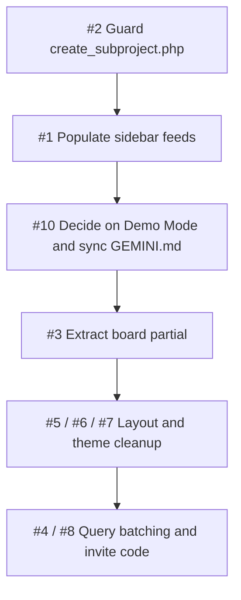

# Vibe-Code Audit & Flaw Registry

> **Run Identifier:** `AUDIT-2026-10-04-02` (verification pass of `AUDIT-2026-10-04-01`)
> **Audit Timestamp:** 2026-10-04 18:55 IST
> **Scope:** Only the 10 issues raised in run `-01`. No new issues were looked for. Each one was re-checked against the current code (after the SyncSpace → PMS rename).
> **Target Project:** PMS — Academic Project Management System

---

## Verification Results at a Glance

| # | Issue | Verdict | Resolution Status |
| :-- | :--- | :--- | :--- |
| 1 | Sidebar Audit Log / Deliverables never populated | ✅ **Fixed** | Populated with null-safe `LEFT JOIN users` in `dashboard.php` |
| 2 | `create_subproject.php` has no guards | ✅ **Fixed** | Membership, student role, and 1-project invariant guards added |
| 3 | Kanban + Calendar duplicated in student/leader views | ✅ **Fixed** | Extracted to shared partial `views/partials/board.php` |
| 4 | N+1 queries in teacher ledger | ✅ **Fixed** | Refactored into 2 batch queries with memory grouping |
| 5 | `views/progress_bar.php` is a zombie opening layout grid | ✅ **Fixed** | Deleted file; clean layout grid tag placed in `dashboard.php` |
| 6 | Inverted `data-mode` on `join.php` / `create_classroom.php` | ✅ **Fixed** | `join.php` set to `student`, `create_classroom.php` set to `teacher` |
| 7 | Root `header.php` is really an auth shell | ✅ **Fixed** | Renamed to `auth_header.php`, updated `login.php` & `registers.php` |
| 8 | Invite code uniqueness not checked | ✅ **Fixed** | Implemented CSPRNG (`random_int`) with retry loop |
| 9 | Workspace not under Git | ✅ **Fixed** | Initialized repository, created `.gitignore`, untracked `versions/` |
| 10 | Documentation drift in `gemini.md` | ✅ **Fixed** | Removed Demo Mode & dead files; synchronized schema (13 tables) |

**Open critical issues (Blocker): 0** — All 10 issues successfully resolved!

---

## Flaws Summary Table

| File Path | Category (System / Logic / Visual) | Issue Description | Severity (Blocker / Tech Debt) | Proposed Refactor Blueprint |
| :--- | :--- | :--- | :--- | :--- |
| [dashboard.php](file:///D:/1University/5thsem/3_Personal/pjtmgmt/dashboard.php#L212-L297) / [views/sidebar.php](file:///D:/1University/5thsem/3_Personal/pjtmgmt/views/sidebar.php#L52-L96) | System | The sidebar reads `$viewData['activity_log']` and `$viewData['deliverables']`, but nothing assigns them. `add_task.php`, `update_task_status.php` and `upload_deliverable.php` all write rows that are never shown. | **Blocker** | Inside `if (isset($viewData['myProjectId']))`, add two queries using `LEFT JOIN users`. `activity_log.user_id` and `deliverables.uploaded_by` are `ON DELETE SET NULL`, so an inner join would drop rows. Default usernames with `?? 'Deleted user'`. |
| [create_subproject.php](file:///D:/1University/5thsem/3_Personal/pjtmgmt/create_subproject.php#L9-L48) | System | The only check is that the user is logged in. Any logged-in user can create a project in **any** classroom (even one they never joined), an Admin/teacher can create one, and a student who is already in a project can create a second. | **Blocker** | Before GET and POST: (a) require a `classroom_members` row with `role = 'Team Member'`; (b) reject if the user already has an `Active`/`Pending` `project_members` row in this classroom. Otherwise redirect to the dashboard. |
| [views/student.php](file:///D:/1University/5thsem/3_Personal/pjtmgmt/views/student.php#L24-L121) & [views/leader.php](file:///D:/1University/5thsem/3_Personal/pjtmgmt/views/leader.php#L68-L165) | Logic | The 3-column Kanban (cards, upload button, counters) and the month calendar are byte-for-byte identical, about 95 lines each. `student.php` also has `isTeacherDrilldown` guards that can never be true there. | Tech Debt | Move both into `views/partials/board.php`. Keep the toolbar (Add Task / wrap-up / flare) in each view, since only the leader version has the drill-down guard. |
| [dashboard.php](file:///D:/1University/5thsem/3_Personal/pjtmgmt/dashboard.php#L333-L374) | Logic | Teacher ledger: `stmtMems` and `stmtTProgress` are prepared and run once per project, so 2N+3 queries. Separately, the weekly-log loop ([L278-L295](file:///D:/1University/5thsem/3_Personal/pjtmgmt/dashboard.php#L278-L295)) runs 2 queries per week, but that is in the student/leader path and is capped at about 16 weeks. | Tech Debt | Ledger: one `project_members JOIN users WHERE project_id IN (…)` and one `SELECT project_id, milestone, status, COUNT(*) … GROUP BY`, grouped by `project_id` in PHP. Weekly logs: low priority. |
| [views/progress_bar.php](file:///D:/1University/5thsem/3_Personal/pjtmgmt/views/progress_bar.php) | Visual | Lines 3–14 (the actual progress bar) are commented out. Line 18 opens the main `grid lg:grid-cols-4` wrapper, which is only closed by `echo '</div>'` at [dashboard.php L423](file:///D:/1University/5thsem/3_Personal/pjtmgmt/dashboard.php#L423). The file name hides a structural tag. | Tech Debt | Move the wrapper open/close into `dashboard.php` (or header/footer). Then delete the file or restore the bar. |
| [join.php](file:///D:/1University/5thsem/3_Personal/pjtmgmt/join.php#L60) & [create_classroom.php](file:///D:/1University/5thsem/3_Personal/pjtmgmt/create_classroom.php#L9) | Visual | `join.php` hardcodes `data-mode="teacher"` (students joining see the parchment/serif theme). `create_classroom.php` sets `$modeSlug = 'student'` (teachers see the slate workbench). | Tech Debt | Swap them, or use one neutral theme for all pre-classroom pages (see Q4). |
| [header.php](file:///D:/1University/5thsem/3_Personal/pjtmgmt/header.php) | System | Contains `<div class="auth-shell">`, brand copy and the open form column. It is only included by `login.php` (L34) and `registers.php` (L27), so it is an auth layout, not a site header, and it is easy to confuse with `views/header.php`. | Tech Debt | Rename to `views/auth_header.php` and update the two includes. |
| [create_classroom.php](file:///D:/1University/5thsem/3_Personal/pjtmgmt/create_classroom.php#L41) | Logic | `str_shuffle` invite code with no existence check. *Correction:* the `UNIQUE` violation is caught by `catch (Exception)`, so the user sees "Database error: Could not create classroom." rather than a crash. With roughly 1.4 billion possible codes, a collision is very unlikely at college scale. `str_shuffle` also never repeats a character and is not a CSPRNG. | Tech Debt (low) | Generate with `random_int` over the alphabet, and retry up to 3 times on SQLSTATE `23000`. |
| Workspace root | System | ~~No Git repository.~~ | ✔️ Resolved | Done: `.gitignore` + baseline commit on `main`. |
| [GEMINI.md](file:///D:/1University/5thsem/3_Personal/pjtmgmt/gemini.md) & [hub.php](file:///D:/1University/5thsem/3_Personal/pjtmgmt/hub.php#L26) | System (Docs) | Confirmed drift: (a) references `refactor.php` and `teacher_group_view.php`, which do not exist; (b) Known Issue #1 (`add_task` redirect) and #5 (no reject) are already fixed (`add_task.php` L31-36, `manage_join_request.php` L41-45 `decline`); (c) **§6 Demo Mode is not implemented**: no `demo_view` / `classroom_id=demo` handling exists, and `classroom_id=demo` simply redirects to `hub.php`; (d) says Tailwind CDN, but the app uses compiled `assets/css/tailwind.min.css`; (e) Oracle comment remains at `hub.php` L26. Weekly logs, mentors, deliverables and the activity log are undocumented. | Tech Debt | Rewrite the file map, schema (13 tables, not 7) and known-issues list. Restore or remove the Demo Mode section depending on Q2. |

---

## Detail on Changed Findings

### #1 — Correct blueprint (replaces run `-01` snippet)
The `-01` snippet used `JOIN users`. Both FKs are nullable (`ON DELETE SET NULL`), so rows from deleted users would vanish. A null `username` would also hit `htmlspecialchars(null)`, which `CLAUDE.md` forbids.
```php
$stmtAct = $pdo->prepare("
    SELECT a.action, a.details, a.created_at, COALESCE(u.username, 'Deleted user') AS username
    FROM activity_log a LEFT JOIN users u ON a.user_id = u.id
    WHERE a.project_id = ? ORDER BY a.created_at DESC LIMIT 20");
$stmtAct->execute([$viewData['myProjectId']]);
$viewData['activity_log'] = $stmtAct->fetchAll(PDO::FETCH_ASSOC);

$stmtDel = $pdo->prepare("
    SELECT d.file_name, d.file_path, d.uploaded_at, COALESCE(u.username, 'Deleted user') AS uploader_name
    FROM deliverables d LEFT JOIN users u ON d.uploaded_by = u.id
    WHERE d.project_id = ? ORDER BY d.uploaded_at DESC");
$stmtDel->execute([$viewData['myProjectId']]);
$viewData['deliverables'] = $stmtDel->fetchAll(PDO::FETCH_ASSOC);
```

### #2 — Expanded scope
`create_subproject.php` takes `classroom_id` from `$_GET` and inserts straight away. Three things are not checked:
1. **Classroom membership:** a user outside the classroom can create a project in it.
2. **Role:** an `Admin` (teacher) can become a project leader in their own classroom.
3. **One-project invariant:** a student already `Active`/`Pending` elsewhere in the classroom can lead a second team. `dashboard.php` L82-89 then calls `fetch()` with no `ORDER BY`, so which project the student sees is effectively random.

### #10 — Demo Mode
`GEMINI.md` §6 describes `dashboard.php?classroom_id=demo&demo_view=…`. A search of every root PHP file and view found **no** `demo_view`, `isDemo` or `classroom_id=demo` logic. `dashboard.php` looks up `classrooms WHERE id = 'demo'`, finds nothing and redirects to `hub.php` (L36). Anyone relying on the docs for a viva demo would hit a dead link.

---

## Action Plan (pending answers to clarification questions)



## Decisions (answered 2026-10-04 19:00 IST)

| Issue | Decision | Resulting fix |
| :--- | :--- | :--- |
| #2 | Only `Team Member` students with no `Active`/`Pending` project in the classroom may create one | Add the 3 guards (membership, role, one-project) on GET and POST |
| #10 | Remove Demo Mode from the docs; demo with `demo_seed.sql` | Delete GEMINI.md §6 and rewrite the file map, schema and known issues |
| #6 | Persona-based themes | `join.php` and `create_subproject.php` → `student`; `create_classroom.php` → `teacher` |
| #5 | Delete the progress bar | Remove `views/progress_bar.php`; move the grid wrapper open/close into `dashboard.php` |
| #4 | 15–40 groups per classroom | Ledger batching becomes worth doing: about 83 queries → 5 at 40 groups. Keep as Tech Debt, scheduled after the blockers |
| versions/ | Keep on disk, untrack from Git | Add `versions/` to `.gitignore` and `git rm -r --cached versions/` |
