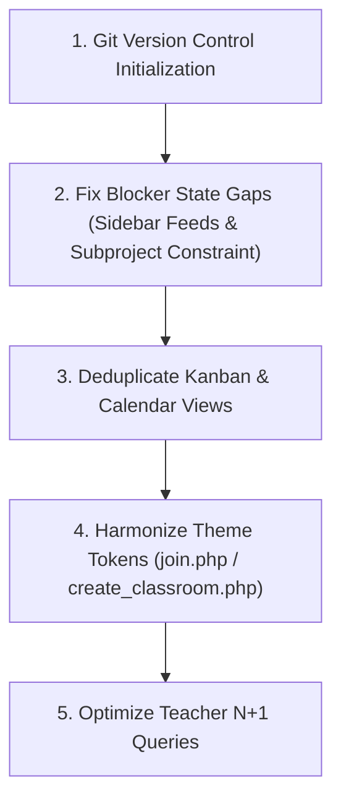

# Vibe-Code Audit & Flaw Registry

> **Run Identifier:** `AUDIT-2026-10-04-01`  
> **Audit Timestamp:** 2026-10-04 18:27:00 IST  
> **Auditor Persona:** Principal Software Architect  
> **Target Project:** PMS Academic Project Management System  

---

## Executive Summary

A comprehensive architectural and code quality audit was performed across the codebase to transition it from rapid "vibe-coding" prototypes into a robust, maintainable, and production-grade engineering platform.

While the core user workflows (contextual roles, VTU USN gating, multi-persona UI tokens, Kanban drag-and-drop) are structurally operational, several critical architectural cracks exist:
1. **Unpopulated State / Broken Feeds:** Core dashboard UI components (Audit Log feed and Deliverables drawer in [views/sidebar.php](file:///D:/1University/5thsem/3_Personal/pjtmgmt/views/sidebar.php)) expect data keys that the controller ([dashboard.php](file:///D:/1University/5thsem/3_Personal/pjtmgmt/dashboard.php)) completely omits to query, leaving them permanently empty.
2. **Missing Invariant Constraints:** Students can bypass the 1-project-per-classroom constraint by directly loading [create_subproject.php](file:///D:/1University/5thsem/3_Personal/pjtmgmt/create_subproject.php), creating conflicting memberships and undefined dashboard state.
3. **Severe Logic Duplication:** The Kanban board and calendar month views are copy-pasted almost identically between [views/student.php](file:///D:/1University/5thsem/3_Personal/pjtmgmt/views/student.php) and [views/leader.php](file:///D:/1University/5thsem/3_Personal/pjtmgmt/views/leader.php).
4. **N+1 Database Query Loops:** The Teacher Ledger runs multiple queries inside loops for every project in the classroom to fetch members and milestone stats, which will degrade severely under larger cohorts.
5. **Visual Theme Inversion:** [join.php](file:///D:/1University/5thsem/3_Personal/pjtmgmt/join.php) forces the `teacher` parchment theme for students joining a class, while [create_classroom.php](file:///D:/1University/5thsem/3_Personal/pjtmgmt/create_classroom.php) defaults to `student` mode for instructors creating a class.

---

## Flaws Summary Table

| File Path | Category (System / Logic / Visual) | Issue Description | Severity (Blocker / Tech Debt) | Proposed Refactor Blueprint |
| :--- | :--- | :--- | :--- | :--- |
| [dashboard.php](file:///D:/1University/5thsem/3_Personal/pjtmgmt/dashboard.php) / [views/sidebar.php](file:///D:/1University/5thsem/3_Personal/pjtmgmt/views/sidebar.php) | **System** | `$viewData['activity_log']` and `$viewData['deliverables']` are never fetched by the controller, leaving the analytics sidebar permanently blank despite active DB writes in endpoints. | **Blocker** | Query `activity_log` and `deliverables` (joined with `users` for uploader usernames) in `dashboard.php` when `myProjectId` is present, and populate `$viewData`. |
| [create_subproject.php](file:///D:/1University/5thsem/3_Personal/pjtmgmt/create_subproject.php) | **System** | Lack of existing project membership verification allows a student to create and lead multiple projects within the same classroom, breaking the 1-student-to-1-project model. | **Blocker** | Add a pre-check query in `create_subproject.php` checking if `$_SESSION['user_id']` is already an `Active` or `Pending` member of any project in `$classroom_id`. Redirect to dashboard if true. |
| [views/student.php](file:///D:/1University/5thsem/3_Personal/pjtmgmt/views/student.php) & [views/leader.php](file:///D:/1University/5thsem/3_Personal/pjtmgmt/views/leader.php) | **Logic** | Complete duplication of the 3-column Kanban board, card elements, action buttons, and calendar month grid between student and leader views. | **Tech Debt** | Extract the board and calendar HTML into a reusable partial `views/components/kanban_board.php` and include it in both `student.php` and `leader.php`. |
| [dashboard.php](file:///D:/1University/5thsem/3_Personal/pjtmgmt/dashboard.php#L333-L374) | **Logic** | N+1 database queries: `stmtMems` and `stmtTProgress` execute sequentially inside `foreach ($realProjects as $rp)`. In a class with 30 groups, this fires 60+ individual queries per request. | **Tech Debt** | Batch-fetch members and task milestone stats with single grouped queries (`GROUP BY project_id, milestone, status`) and map them in PHP memory before rendering. |
| [views/progress_bar.php](file:///D:/1University/5thsem/3_Personal/pjtmgmt/views/progress_bar.php) | **Visual** | Zombie / misleading markup: The actual progress bar component is commented out, but this file opens the outer `<div class="flex-1 p-6 grid grid-cols-1 lg:grid-cols-4 gap-6">` grid container that wraps other views. | **Tech Debt** | Move the workspace wrapper div directly into `views/header.php` (or a dedicated layout shell), and either restore or delete the commented-out progress bar. |
| [join.php](file:///D:/1University/5thsem/3_Personal/pjtmgmt/join.php) & [create_classroom.php](file:///D:/1University/5thsem/3_Personal/pjtmgmt/create_classroom.php) | **Visual** | Inverted CSS `data-mode` tokens: `join.php` uses `data-mode="teacher"`, while `create_classroom.php` defaults to `data-mode="student"`. | **Tech Debt** | Set `join.php` to `data-mode="student"` and `create_classroom.php` to `data-mode="teacher"`, matching user personas. |
| [header.php](file:///D:/1University/5thsem/3_Personal/pjtmgmt/header.php) | **System** | Confusing root naming convention: Root `header.php` is strictly an auth page shell (`<div class="auth-shell">...`) rather than a site header, conflicting in purpose with `views/header.php`. | **Tech Debt** | Rename root `header.php` to `auth_header.php` (or move to `views/auth_header.php`) and update `login.php` and `registers.php` includes. |
| [create_classroom.php](file:///D:/1University/5thsem/3_Personal/pjtmgmt/create_classroom.php#L41) | **Logic** | `str_shuffle` generates a 6-character invite code without verifying uniqueness prior to insertion. A collision will throw a PDO exception and fail the transaction. | **Tech Debt** | Wrap invite code generation in a small `do...while` existence check or catch unique constraint violation code (`23000`) and retry. |
| Workspace Root | **System** | Repository is not tracked by Git (`fatal: not a git repository`). No version history or rollback safety net exists. | **Blocker** | Run `git init`, add standard `.gitignore` (ignoring `uploads/*`, `node_modules/`), and create an initial baseline commit. |
| [GEMINI.md](file:///D:/1University/5thsem/3_Personal/pjtmgmt/GEMINI.md) & [hub.php](file:///D:/1University/5thsem/3_Personal/pjtmgmt/hub.php#L26) | **Documentation** | Documentation drift: references deleted files (`refactor.php`, `teacher_group_view.php`), outdated claim that join requests cannot be rejected, and leftover Oracle SQL comments. | **Tech Debt** | Synchronize `GEMINI.md` with active files, remove outdated Oracle comments, and document newly introduced modules (weekly logs, mentor reviews). |

---

## Detailed Architectural Findings

### 1. State Management Fragmentation & Data Gaps

#### Issue 1.1: Missing Activity Log & Deliverables Feed in Controller
- **Location:** [views/sidebar.php](file:///D:/1University/5thsem/3_Personal/pjtmgmt/views/sidebar.php#L52-L96) vs [dashboard.php](file:///D:/1University/5thsem/3_Personal/pjtmgmt/dashboard.php)
- **Manifestation:**
  When a user adds a task or changes status, entries are inserted into `activity_log`:
  ```php
  // add_task.php
  $stmtLog = $pdo->prepare("INSERT INTO activity_log (project_id, user_id, action, details) VALUES (?, ?, 'Created Task', ?)");
  // upload_deliverable.php
  $stmt = $pdo->prepare("INSERT INTO deliverables (project_id, task_id, uploaded_by, file_name, file_path) VALUES (?, ?, ?, ?, ?)");
  ```
  However, in `dashboard.php`, `$viewData['activity_log']` and `$viewData['deliverables']` are never queried from the database. Consequently, the sidebar audit tab and deliverables tab always render empty states (*"No activity recorded yet"* / *"No files uploaded yet"*).
- **Refactoring Blueprint:**
  In `dashboard.php` within `if (isset($viewData['myProjectId']))`:
  ```php
  // Fetch Activity Log
  $stmtAct = $pdo->prepare("
      SELECT a.*, u.username 
      FROM activity_log a 
      JOIN users u ON a.user_id = u.id 
      WHERE a.project_id = ? 
      ORDER BY a.created_at DESC LIMIT 15
  ");
  $stmtAct->execute([$viewData['myProjectId']]);
  $viewData['activity_log'] = $stmtAct->fetchAll(PDO::FETCH_ASSOC);

  // Fetch Deliverables
  $stmtDeliv = $pdo->prepare("
      SELECT d.*, u.username as uploader_name 
      FROM deliverables d 
      JOIN users u ON d.uploaded_by = u.id 
      WHERE d.project_id = ? 
      ORDER BY d.uploaded_at DESC
  ");
  $stmtDeliv->execute([$viewData['myProjectId']]);
  $viewData['deliverables'] = $stmtDeliv->fetchAll(PDO::FETCH_ASSOC);
  ```

#### Issue 1.2: Unchecked Project Creation Bypass
- **Location:** [create_subproject.php](file:///D:/1University/5thsem/3_Personal/pjtmgmt/create_subproject.php#L19-L48)
- **Manifestation:**
  A student already in an active project can navigate directly to `create_subproject.php?classroom_id=X` and create another project. Because `dashboard.php` performs a single `fetch()` on `project_members`, the student will experience erratic dashboard routing and duplicate team assignments.
- **Refactoring Blueprint:**
  Before processing the form or displaying the page in `create_subproject.php`, check:
  ```php
  $stmtCheckExisting = $pdo->prepare("
      SELECT 1 FROM project_members pm
      JOIN projects p ON pm.project_id = p.id
      WHERE p.classroom_id = ? AND pm.user_id = ? AND pm.join_status IN ('Active', 'Pending')
  ");
  $stmtCheckExisting->execute([$classroom_id, $_SESSION['user_id']]);
  if ($stmtCheckExisting->fetch()) {
      header("Location: dashboard.php?classroom_id=" . urlencode($classroom_id));
      exit;
  }
  ```

---

### 2. Logic Duplication & Query Efficiency

#### Issue 2.1: Kanban & Calendar Markup Duplication
- **Location:** [views/student.php](file:///D:/1University/5thsem/3_Personal/pjtmgmt/views/student.php#L24-L128) and [views/leader.php](file:///D:/1University/5thsem/3_Personal/pjtmgmt/views/leader.php#L48-L160)
- **Manifestation:**
  Over 110 lines of complex markup (Kanban columns, sortable container IDs, card item templates, badges, calendar week cells) are completely duplicated between `student.php` and `leader.php`. Any enhancement to the card design or calendar behavior must be manually synced across both files.
- **Refactoring Blueprint:**
  Extract the entire board markup into `views/components/board_view.php`. Both views then simply call:
  ```php
  require __DIR__ . '/components/board_view.php';
  ```

#### Issue 2.2: N+1 Loops in Teacher Dashboard Ledger
- **Location:** [dashboard.php](file:///D:/1University/5thsem/3_Personal/pjtmgmt/dashboard.php#L333-L374)
- **Manifestation:**
  For each project `$rp`, the controller executes:
  1. Member query (`stmtMems`)
  2. Tasks status query (`stmtTProgress`)
  In addition, weekly logs loop files (`stmtFiles`) and attendance (`stmtAtt`) queries per log entry.
- **Refactoring Blueprint:**
  Replace per-project queries with two batch queries using `WHERE project_id IN (...)` and aggregate them into hash maps keyed by `project_id`.

---

### 3. Visual & Layout Drift

#### Issue 3.1: CSS Theme Inversion on Core Action Pages
- **Location:** [join.php](file:///D:/1University/5thsem/3_Personal/pjtmgmt/join.php#L60) (`data-mode="teacher"`) vs [create_classroom.php](file:///D:/1University/5thsem/3_Personal/pjtmgmt/create_classroom.php#L61) (`data-mode="student"`)
- **Manifestation:**
  PMS uses design tokens (`pms.css`) to visually differentiate roles:
  - `teacher`: Serif fonts, parchment light background.
  - `student`: IBM Plex Sans, dark slate workbench.
  - `leader`: IBM Plex Sans Condensed, navy cockpit.
  A student joining a class is greeted with the teacher theme, while an instructor creating a classroom sees the student theme.
- **Refactoring Blueprint:**
  Harmonize `data-mode` to match the intended persona:
  - `join.php` -> `data-mode="student"`
  - `create_classroom.php` -> `data-mode="teacher"`

#### Issue 3.2: Structural Tag Mismatch in `views/progress_bar.php`
- **Location:** [views/progress_bar.php](file:///D:/1University/5thsem/3_Personal/pjtmgmt/views/progress_bar.php)
- **Manifestation:**
  The file name implies it contains a progress bar, but lines 3-14 are commented out. Instead, line 18 opens `<div class="flex-1 p-6 grid grid-cols-1 lg:grid-cols-4 gap-6">` without closing it, which is later closed in `dashboard.php` via `echo '</div>';`.
- **Refactoring Blueprint:**
  Move the layout opening tag to `views/header.php` and its closing tag to `views/footer.php`. Remove or restore `views/progress_bar.php` cleanly.

---

## Action Plan & Immediate Priorities



1. **Safety First:** Initialize Git version control so every refactor can be reviewed and rolled back cleanly.
2. **Fix Functional Data Flow:** Add the missing queries in `dashboard.php` so the Audit Log and Deliverables feeds work as intended.
3. **Enforce Project Invariant:** Prevent duplicate project creation in `create_subproject.php`.
4. **Extract Board Component:** Eliminate the duplicate Kanban and Calendar code across `student.php` and `leader.php`.
5. **Theme Alignment:** Fix the inverted `data-mode` attributes on `join.php` and `create_classroom.php`.
